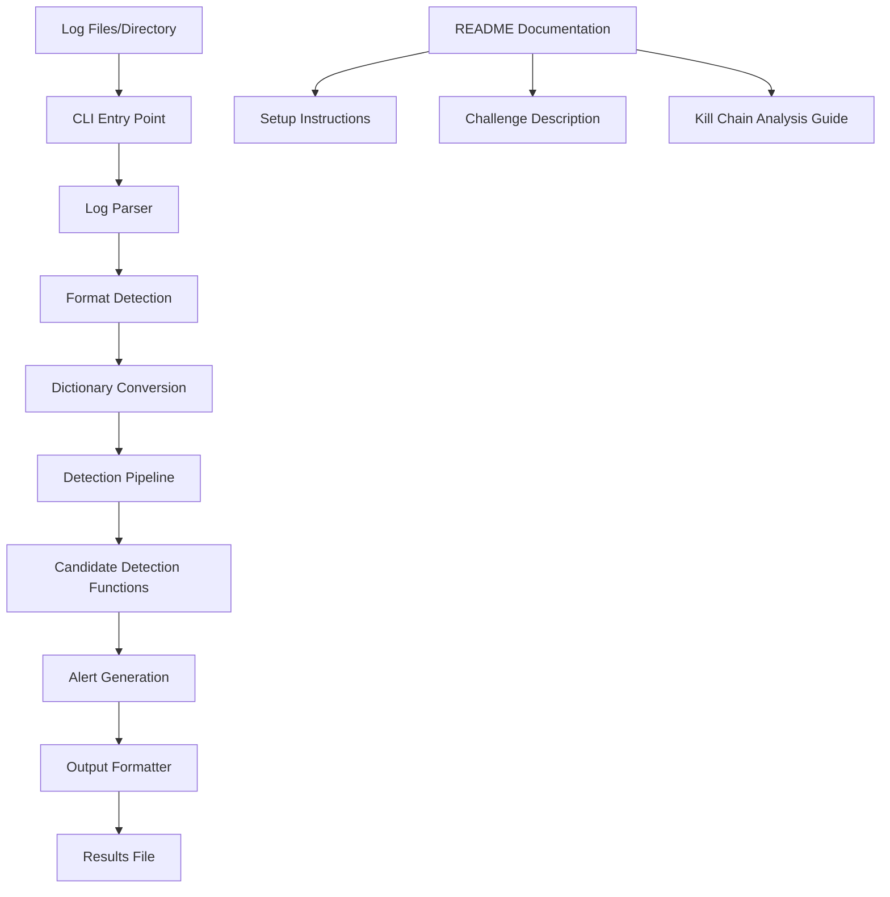

# Design Document

## Overview

The threat detection challenge repository is designed as a standalone Python project that candidates receive to demonstrate their threat detection and digital forensics skills. The system consists of a CLI script that parses security logs from files, processes them through candidate-implemented detection functions, and outputs filtered results. The architecture emphasizes simplicity and clarity, allowing candidates to focus on detection logic rather than infrastructure complexity.

## Architecture

### High-Level Architecture



### Component Interaction Flow

1. **Input Processing**: CLI accepts file/directory paths for log processing
2. **Output Sink Setup**: Initialize output sink for writing enriched logs and alerts
3. **File Reading**: Simple line-by-line reading of log files
4. **Raw Line Processing**: Each raw log line passed to candidate detection functions
5. **Log Enrichment**: Candidates parse logs, detect threats, and send enriched data to output sink
6. **Side Effect Execution**: Detection functions write alerts/enriched logs via output sink
7. **Process Completion**: Pipeline completes after processing all log lines, output file contains results

## Components and Interfaces

### CLI Interface (`src/cli.py`)

**Purpose**: Entry point for the challenge script with argument parsing and orchestration

**Interface**:
```python
def main():
    # Parse command line arguments
    # Initialize detection pipeline
    # Execute processing
    # Output results
```

**Arguments**:
- `--in`: Input directory or file path (required)
- `--out`: Output file path (default: alerts.json)
- `--format`: Optional output format specification

### Log Reader (`src/detector/sources.py`)

**Purpose**: Simple file reading that passes raw lines to candidate functions

**Interface**:
```python
def read_log_files(input_path: str) -> Iterator[str]:
    # Handle both file and directory input paths
    # Read files line by line
    # Yield raw log lines to pipeline
```

**Approach**:
- Single iterator interface for all log reading
- No format detection or parsing
- Raw lines passed directly to candidate functions
- Candidates handle all data modeling and parsing
- Simple file iteration and line reading only

### Detection Pipeline (`src/detector/pipeline.py`)

**Purpose**: Orchestrates log processing by reading files line by line and coordinating with output sink

**Interface**:
```python
class DetectionPipeline:
    def __init__(self, input_path: str, output_path: str):
        # Initialize pipeline with input source and output sink
        
    def process_logs(self) -> None:
        # Read log files line by line
        # Pass each raw line to candidate detection functions
        # Candidate functions perform side effects via output sink
        
    def process_line(self, raw_line: str) -> None:
        # Pass raw log line to candidate-implemented detection functions
        # Candidate handles parsing, detection, and writing to output sink
```

### Output Sink (`src/detector/sink.py`)

**Purpose**: Provides interface for candidates to write enriched logs and alerts to output file

**Interface**:
```python
class OutputSink:
    def __init__(self, output_path: str):
        # Initialize output file for writing results
        
    def write_alert(self, alert: dict) -> None:
        # Write alert/enriched log entry to output file
        # Handle JSON formatting and file operations
        
    def close(self) -> None:
        # Finalize output file and cleanup resources
```

### Detection Rules (`src/detector/rules.py`)

**Purpose**: Log processing tool that enriches logs with detection information

**Interface**:
```python
class ThreatDetector:
    def __init__(self, output_sink):
        # Initialize with reference to output sink for writing results
        
    def process_log_line(self, raw_line: str) -> None:
        # PLACEHOLDER: Candidate implements parsing and detection logic
        # Parse raw log line and extract relevant fields
        # Apply detection rules and enrich log with threat information
        # Write enriched logs/alerts to output sink via side effects
        pass
```

**Enriched Log/Alert Format**:
```python
{
    "timestamp": "2024-01-01T12:00:00Z",
    "severity": "high|medium|low|critical",
    "threat_type": "descriptive_threat_name",
    "source_log": "original_log_entry_reference",
    "evidence": "description_of_suspicious_activity",
    "confidence": 0.85,  # Optional confidence score
    "metadata": {},  # Additional context
    "enriched_fields": {}  # Fields added by detection logic
}
```

## Data Models

### Raw Log Processing

**Input**: Raw log lines as strings
- Candidates receive unprocessed log lines
- No predefined structure or parsing
- Candidates must handle data modeling and extraction
- Various log formats may be present (JSON, CSV, custom formats)

**Candidate Responsibility**:
- Parse and structure raw log data
- Extract relevant fields for analysis
- Handle malformed or incomplete entries
- Design appropriate data models for detection logic

### Enriched Log/Alert Output

**Standard Output Format**:
```python
{
    "id": str,                    # Unique entry identifier
    "timestamp": str,             # Original or detection timestamp
    "severity": str,              # Severity level (if threat detected)
    "threat_type": str,           # Classification of threat (if applicable)
    "description": str,           # Human-readable description
    "source_log": str,            # Reference to original log entry
    "confidence": float,          # Detection confidence (0-1)
    "metadata": dict,             # Additional context
    "enriched_fields": dict,      # Fields added by detection processing
    "original_log": str           # Original raw log line for reference
}
```

## Error Handling

### File Processing Errors

**Strategy**: Graceful degradation with detailed logging

**Implementation**:
- Log parsing failures recorded but don't stop processing
- Malformed entries skipped with warning messages
- File access errors reported with helpful guidance
- Invalid input paths handled with clear error messages

### Detection Function Errors

**Strategy**: Isolation and continuation

**Implementation**:
- Exceptions in candidate code caught and logged
- Processing continues with remaining detection functions
- Error details provided for debugging
- Partial results still generated when possible

### Output Generation Errors

**Strategy**: Fallback mechanisms

**Implementation**:
- Primary output format failures trigger fallback formats
- Partial results saved when complete processing fails
- Clear error messages guide troubleshooting
- Temporary files used to prevent data loss

## Candidate Evaluation Areas

### Core Competencies Assessed

**Data Modeling and Parsing**:
- Ability to parse weakly structured log data
- Handling of various log formats and edge cases
- Extraction of relevant fields for analysis
- Error handling for malformed entries

**Detection Logic Implementation**:
- Threat detection rule development
- Pattern recognition in security events
- Alert generation and prioritization
- False positive minimization

**Code Quality** (Optional):
- Candidates may provide tests if they choose
- Code organization and documentation
- Performance considerations and optimization
- Error handling and edge case management

## Documentation Structure

### README Sections

1. **Project Overview**: Challenge description and objectives
2. **Setup Instructions**: Poetry installation and dependency management
3. **Running the Challenge**: Command-line usage and examples
4. **Kill Chain Analysis**: Forensic investigation guidance
5. **Detection Implementation**: Placeholder function documentation
6. **Output Format**: Expected result structure and validation
7. **Troubleshooting**: Common issues and solutions
8. **Submission Guidelines**: Deliverable requirements

### Code Documentation

**Docstring Standards**:
- All public functions documented with purpose and parameters
- Example usage provided for complex functions
- Error conditions and return values specified
- Type hints used throughout codebase

**Inline Comments**:
- Placeholder functions clearly marked for candidate implementation
- Complex logic explained with contextual comments
- TODO items identified for candidate completion
- Performance considerations noted where relevant

## Performance Considerations

### Basic Framework Requirements

**Simple Implementation**:
- Line-by-line file reading for memory efficiency
- Basic error handling for file operations
- Minimal framework overhead

**Candidate Optimization Opportunities**:
- Performance improvements left to candidate implementation
- Memory management strategies for large datasets
- Processing efficiency optimizations
- Scalability enhancements as needed